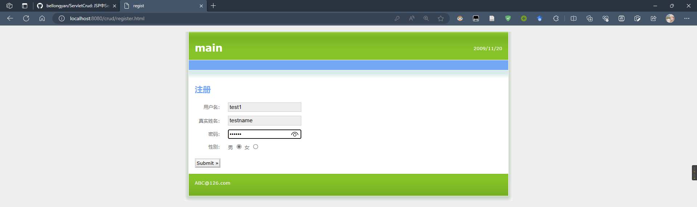
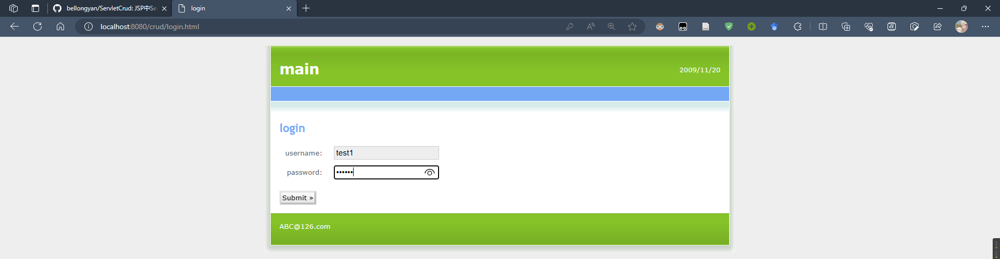
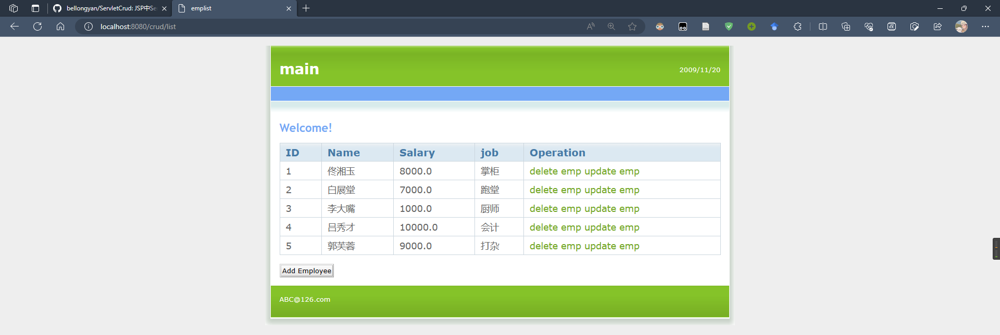
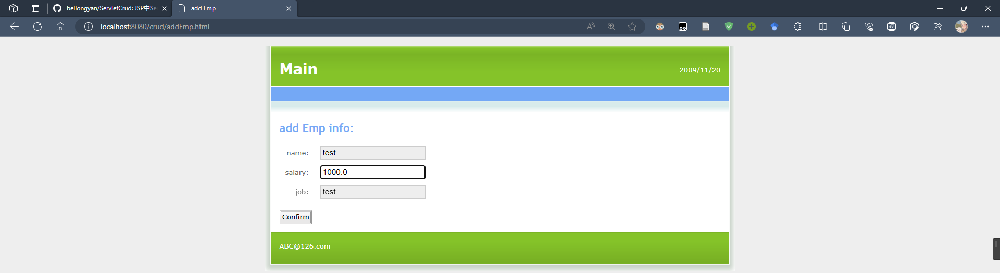
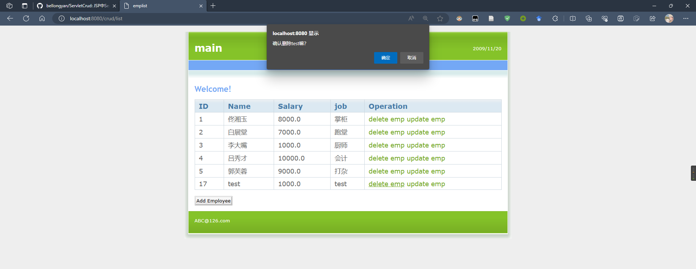
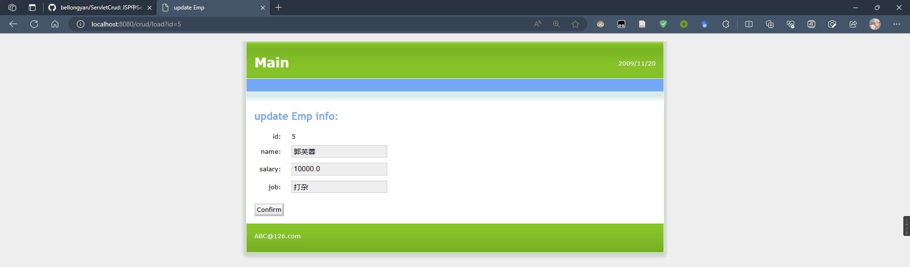
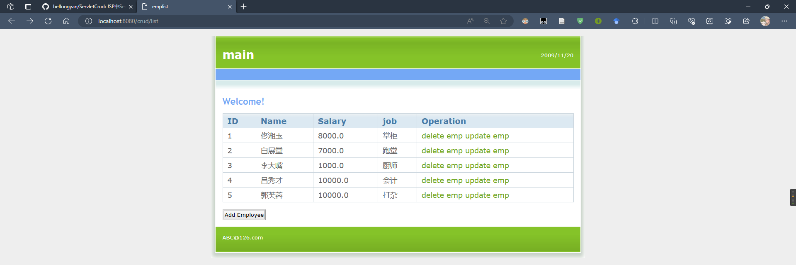

# ServletCrud
JSP中Servlet的crud操作

## 工具及版本

|工具|版本|
|---|---|
|IntelliJ IDEA|2023.1.3(Ultimate Edition)|
|Project SDK|Amazon Corretto version 1.8.0_372|
|Apache Tomcat|9.0.75|
|Database|8.0.33 MySQL Community Server|
|JDBC driver|mysql-connector-j-8.0.32|

## 页面

注册页面

登录页面

主页面

添加信息

删除信息

更新信息

更新后的记录

